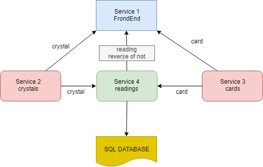
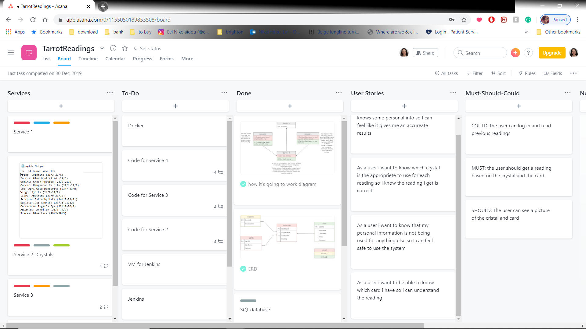
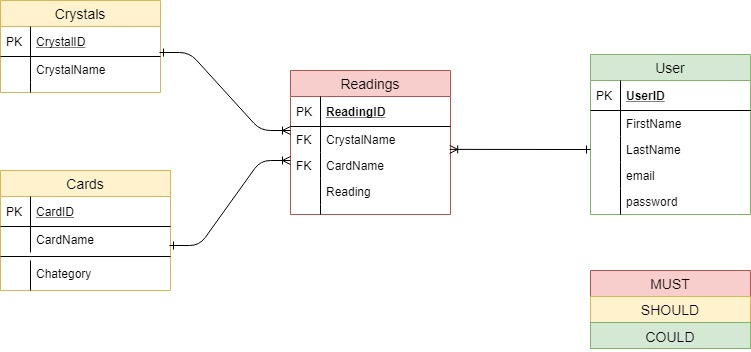
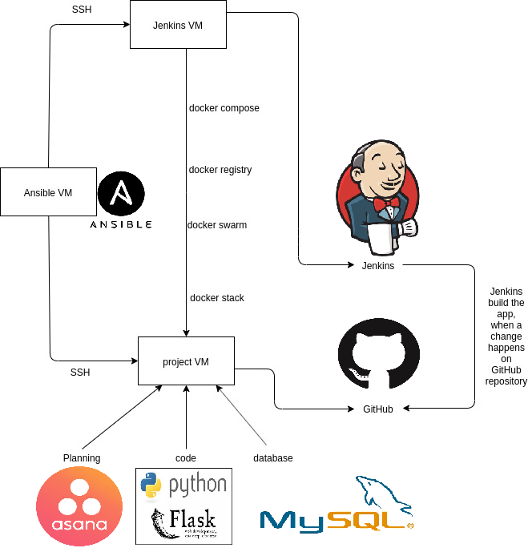

# QAProject2: Tarot Readings with the help of crystals!

Resources:

- Presentation:https://docs.google.com/presentation/d/1-A8vGamEZoOs1nNMGctTYBNGC4jAqh0AXrywU5aQFDI/edit?usp=sharing
    
- Asana: https://app.asana.com/0/1155050189853508/board
    
- Website: 34.89.115.195
- Jenkins: 35.242.191.186:8080 

# The brief

The requirements of the project are as follows:

 - An Asana board (or equivalent Kanban board tech) with full expansion 
   on tasks needed to complete the project. This must also provide a   
   record of any issues or risks that you faced creating your project.  
  - An Application fully integrated into a Version Control System which  
   will subsequently be built through a CI server and deployed to a   
   cloud-based virtual machine. If a change is made to a code base, then
   Web hooks should be used so that Jenkins recreates and redeploys the 
   changed application 
  - The project must follow the service-oriented architecture that has been asked for. 
  - The project must be deployed  using containerisation. 
   - As part of the project you need to create an Ansible Playbook that will provision the environment that your application needs to run.

# My approach 
I created an app which randomly choose a crystal from a list and a randomly choose a card from the Tarrot Deck. Therefore, depenting on the crystal you get the the meaning of the card or the reverse meaning of the card.

# Microservise Architecture

# Planing
The planning of this project happent through Asana 

# User Stories
|No|User Story  |
|--|--|
| 1 | As a user,I want to feel like the system knows some personal info so I can feel like it gives me an accureate results |
| 2|As a user i want to know that my personal information is not being used for anything else so I can feel safe to use the system  |
| 3 | As a user I want to know which crystal is the appropriete to use for each reading so i  know the reading i get is correct |
| 5| As a user i want to be able to know which card i have so i can understand the reading |

# EDR

# Technology that was used
- Python 
- Flask
- json
- Docker
- Jenkins
- NGINX
- Git
- Google Cloud Platform
- Ansible

# Risk Assesment
|RISK|INPACT|LIKELIHOOD|Mitigation measure|
|--|--|--|--|
|Not meeting the deadline|High-not covering all aspects of project|Medium|Good time management and planning of the process. Asana will be used to avoid this issue|
|Data Lost|Medium- losing python files could slow down the process of completing the project|Low|Pushing all needed files on Github as often as possible will prevent data lost|
|GPC malfunctions|High-if a vm is malfunctioning, you will need to create a new one and re-install everything.This will be time-consuming|High|Creating an ansible playbook will not prevent this risk but it will be much easier and faster creating a new one|
|issues with DevOps (Jenkins, Docker, Ansible)|High- one is depending on another, therefore high risk of not meeting the project's criteria|Medium|Understanding the material and doing all the exercises that are given to me
|pytest issues|Low due to the app's structure not many tests can be run, with the knowledge we have so far|Low|Tests are relatively easy for this app so it should be easy to get fixed|

# Deployment

# Steps to use this app
1)Create 3 vms (app,jenkins,ansible) 
2)Clone this repository to one vm (app)
3)Run the ansible files in one vm (anible) and ssh this vm to the other two (jenkins and app) 
4)Create an sql database named "reading" and connected it to the vm that you clone the repository to (app)
5)Start Jenkins

# Future Updates

 - Add all 78 cards of the tarrot deck (currently only 22 cards)
 - Debug Jenkins
 - Automate testing
 - Create all the tables of the EDR

# References
The meaninig of each card can be found: 
[https://python-tarot.herokuapp.com/](https://python-tarot.herokuapp.com/)
